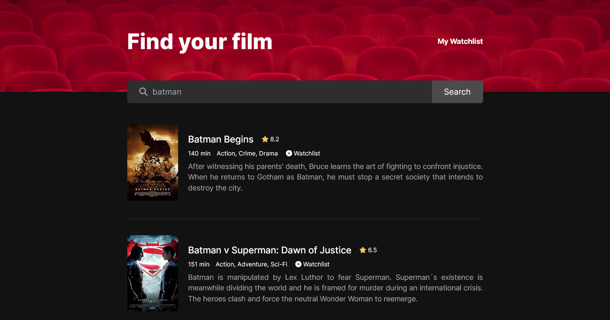

#  Watchflicks

Watchflicks is a movie watchlist app that allows the user to search for movies and add them to watch later. Powered by [The Open Movie Database API](http://www.omdbapi.com/), it provides a list of movies based on the user's search query.

### Screenshot

### Link

- Live Site URL: [Netlify](https://watchflicks.netlify.app)

### Built with

- HTML
- CSS
- JavaScript

### Acknowledgments

[The Open Movie Database API](http://www.omdbapi.com/)
